# chap0x01实验报告


## 实验要求

- [x] 虚拟硬盘配置成多重加载
- [x] 搭建满足要求的网络拓扑
- [x] 完成连通性测试
  - [x] 靶机可以直接访问攻击者主机
  - [x] 攻击者主机无法直接访问靶机
  - [x] 网关可以直接访问攻击者主机和靶机
  - [x] 靶机的所有对外上下行流量必须经过网关
  - [x] 所有节点均可以访问互联网


## 实验过程

### 网络拓扑

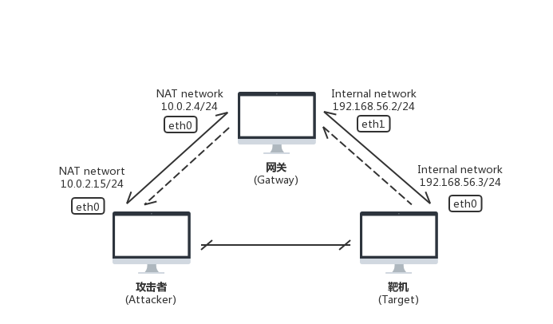

### 多重加载

- 安装好一个Kali虚拟机
- 将安装好的虚拟机释放并将类型改为多重加载
- 使用已有的虚拟硬盘文件，创建实验所需的三台虚拟机（攻击者，网关和靶机）

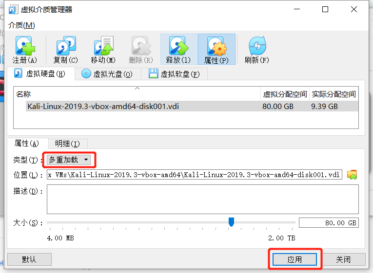

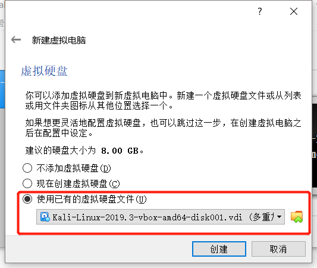

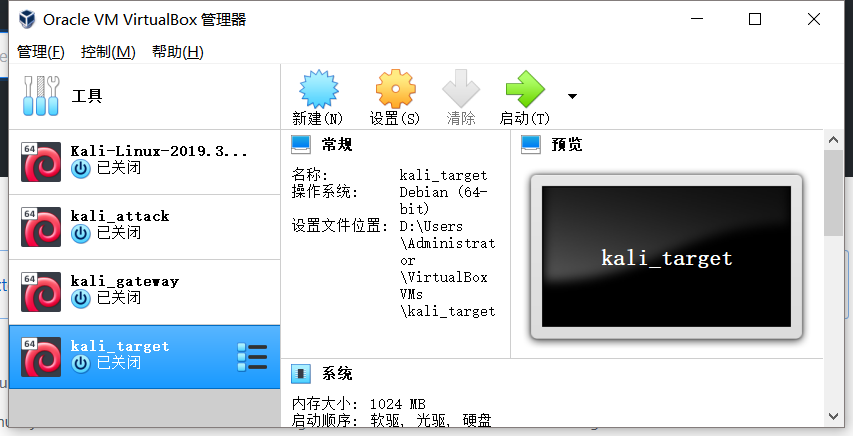


### 网卡及网络配置

#### NAT网络

- 在 VirualBox->全局设定->网络 中，添加一个新NAT网络，供攻击者和网关使用

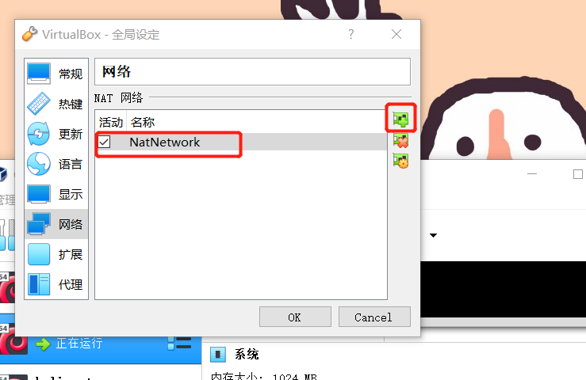


#### 攻击者

- 启用一块网卡，设置为NAT network模式

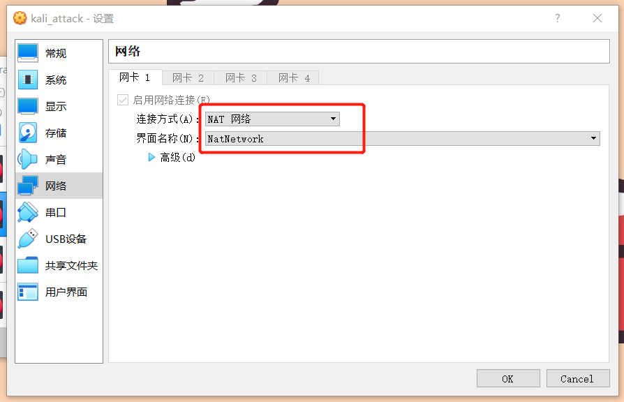

- 自动分配地址 10.0.2.15，与网关的一块网卡处于同一个网段

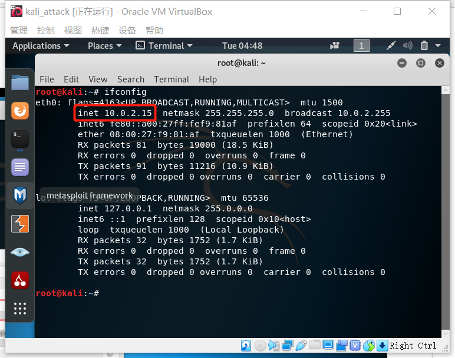


#### 网关

- 启用两块网卡，网卡1设置为 NAT network 模式，网卡2设置为 内部网络 模式

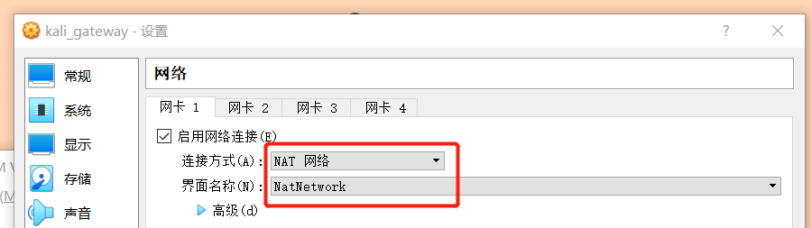

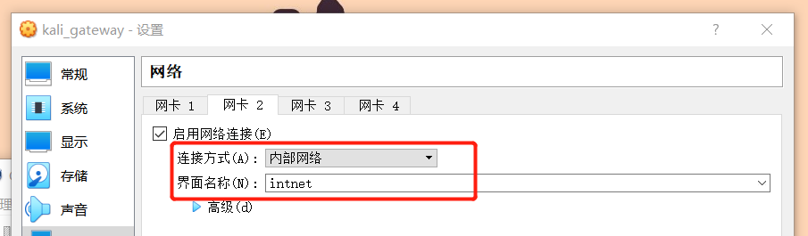

- 网卡1（eth0）自动分配地址 10.0.2.15，与攻击者处于同一网段
- 网卡2（eth1）手动分配地址为 192.168.56.2，与靶机处于同一网段
- 使用命令行开启IP转发，并定义转发规则（192.168.56.0/24->eth0）

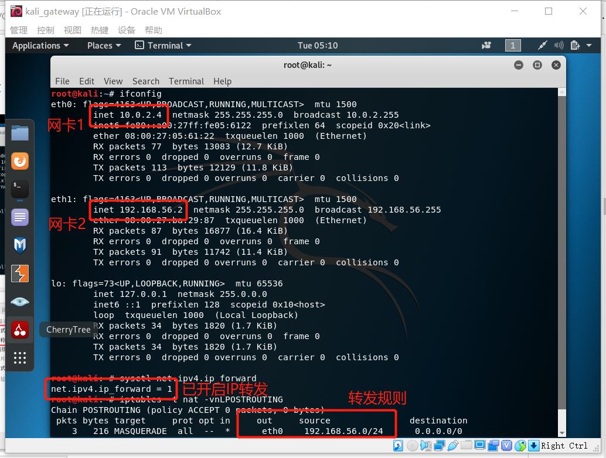


#### 靶机

- 手动分配地址为 192.168.56.3，与网关的一块网卡处于同一网段
- 使用命令行将网关设置为 192.168.56.2

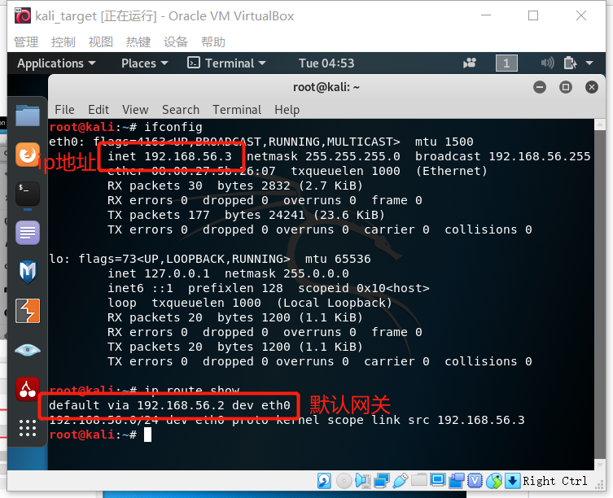


### 连通性测试

#### 攻击者

- 攻击者主机无法直接访问靶机
- 攻击者主机可以访问互联网

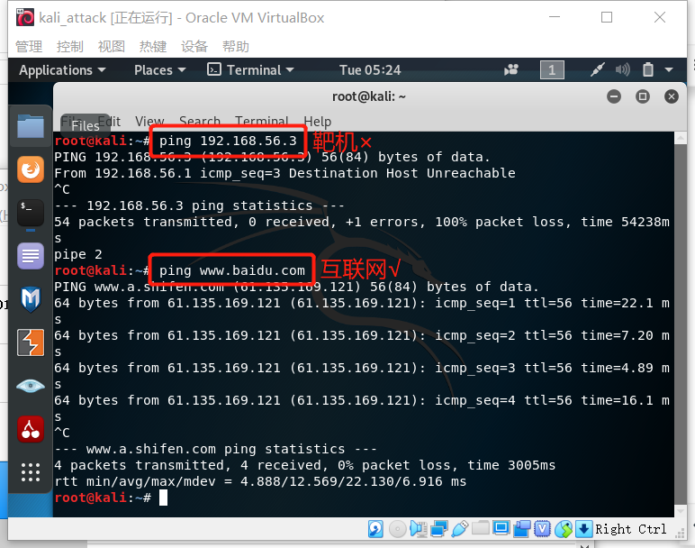

#### 网关

- 网关可以直接访问靶机
- 网关可以直接访问攻击者主机
- 网关可以访问互联网

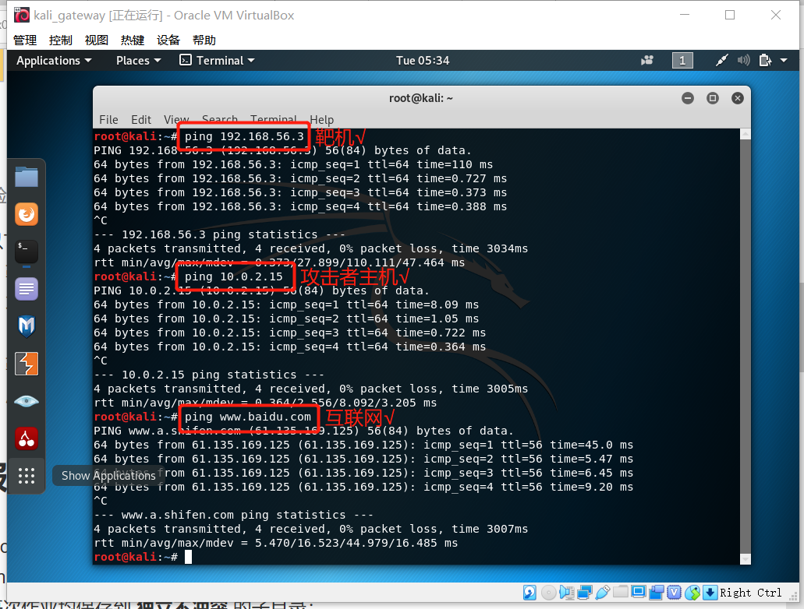

- 靶机的所有对外上下行流量必须经过网关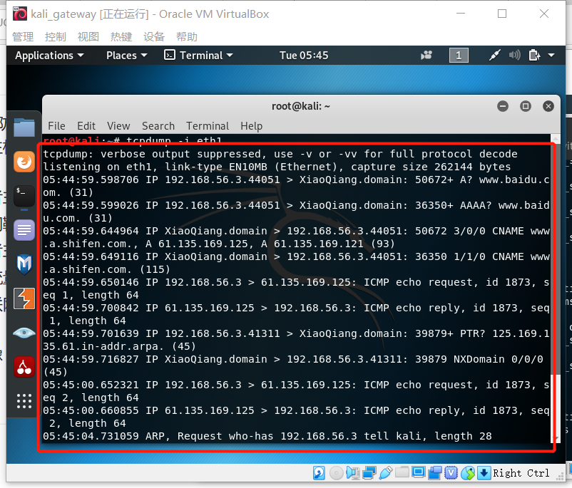

#### 靶机

- 靶机可以直接访问攻击者主机
- 靶机可以访问互联网

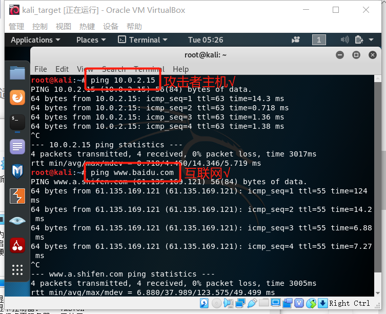


## 实验总结

### VirtualBox的网络连接方式

|                  | NAT  | Bridged Adapter |    Internal    | Host-only Adapter |
| ---------------- | :--: | :-------------: | :------------: | :---------------: |
| 虚拟机->主机     |  +   |        +        |       -        | 默认不能，需设置  |
| 主机->虚拟机     |  -   |        +        |       -        | 默认不能，需设置  |
| 虚拟机->其他主机 |  +   |        +        |       -        | 默认不能，需设置  |
| 其他主机->虚拟机 |  -   |        +        |       -        | 默认不能，需设置  |
| 虚拟机之间       |  -   |        +        | 同名网络下可以 |         -         |

### 此次用到的命令行

```
ifconfig eth0 192.168.56.2				//设置eth0地址为192.168.56.2
route add default gw 192.168.56.2		//设置默认网关为192.168.56.2
ip route show							//显示路由信息
systemctl restsrt networking.service	//重启
sysctl -w net.ipv4.ip_forward=1			//启用IP转发
iptables -t nat -A POSTROUTING -s 192.168.56.2/24 -o eth0 -j MASQUERADE	//设置转发规则
iptables -t nat -vnLPOSTROUTING			//查看转发规则
```


## 参考资料

- [VirtualBox的四种网络连接方式-CSDN](https://blog.csdn.net/wzygis/article/details/44726431)
- [基于VirtualBox的网络攻防基础环境搭建-jckling](https://github.com/CUCCS/2018-NS-Public-jckling/blob/master/ns-0x01/基于VirtualBox的网络攻防基础环境搭建.md)
- [Linux命令查询](https://wangchujiang.com/linux-command/)