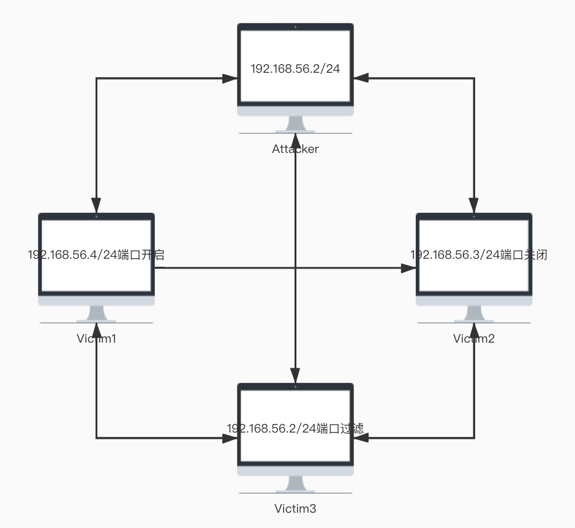
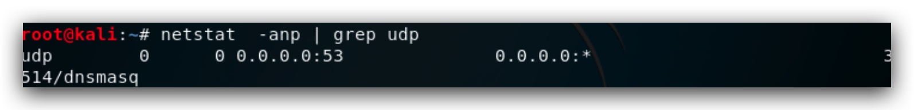
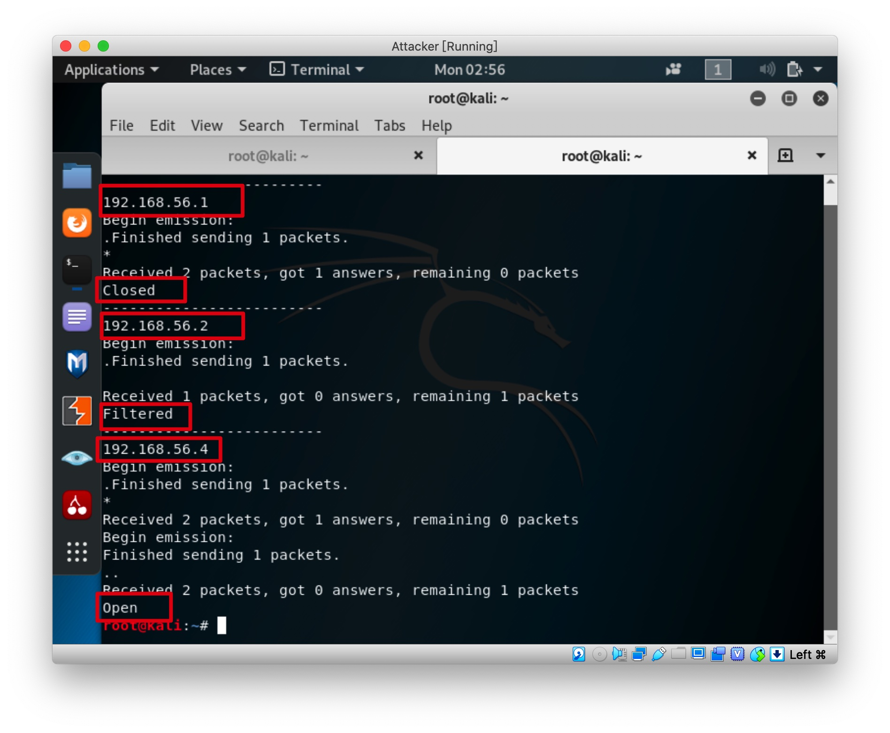
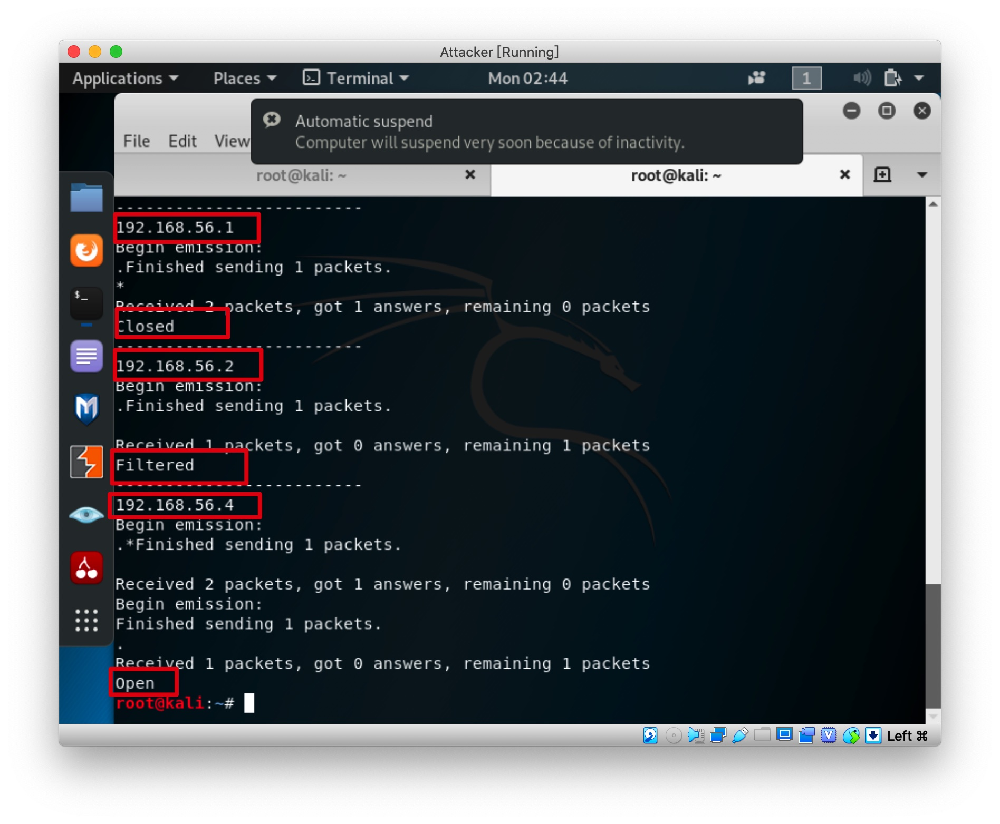
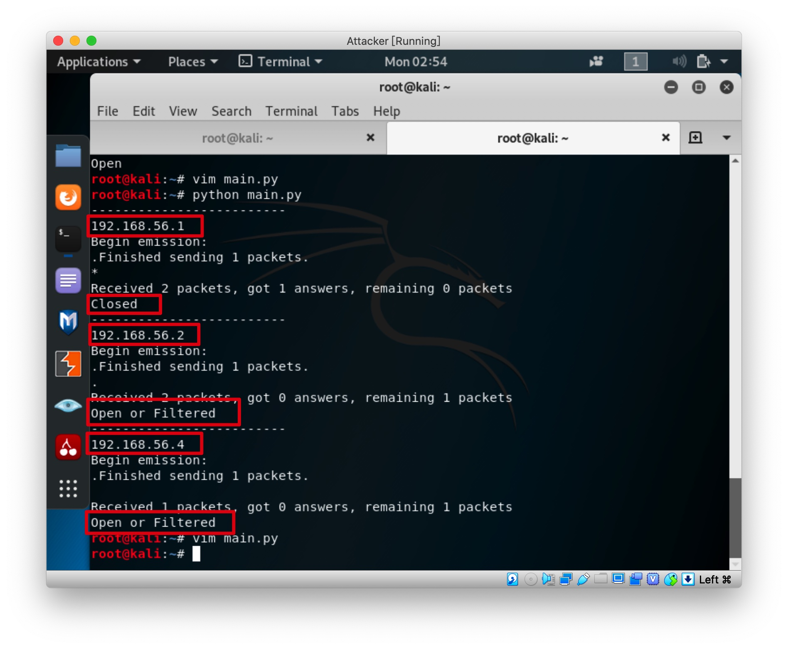
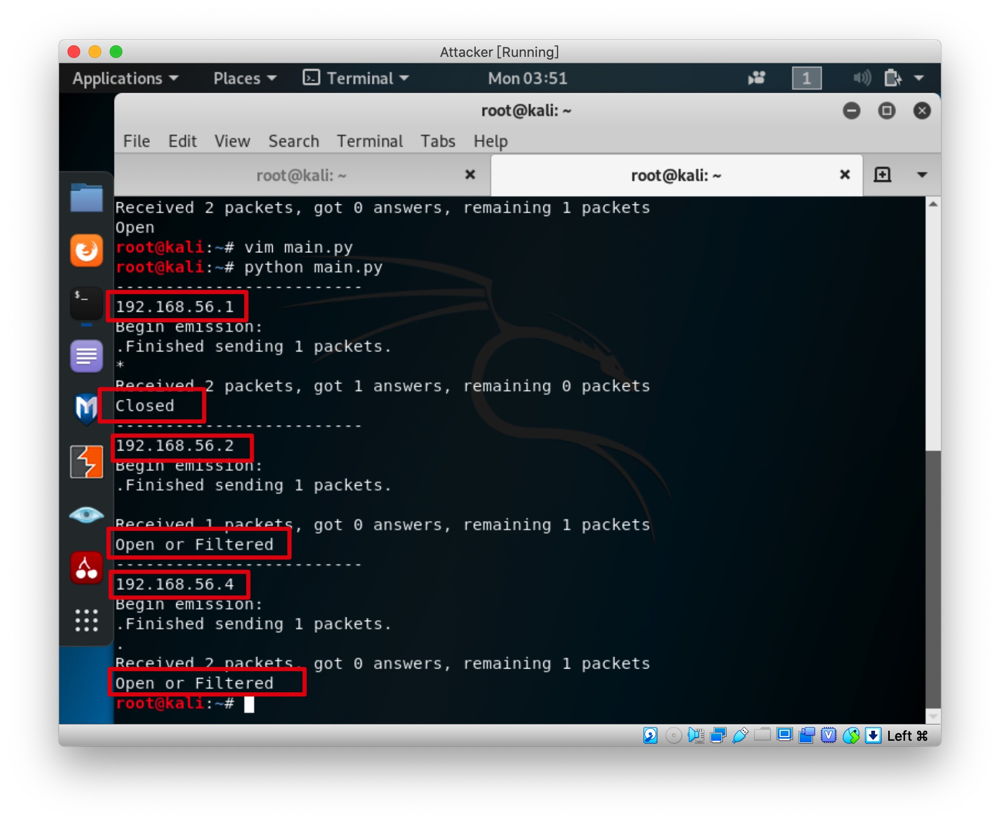
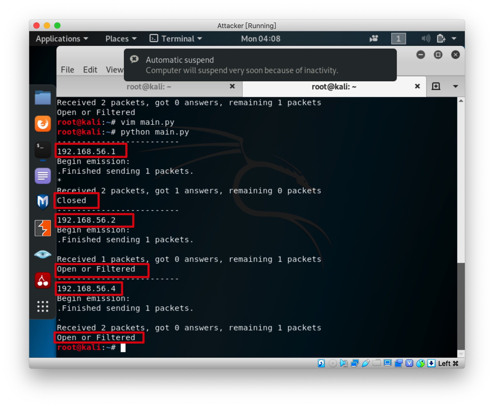
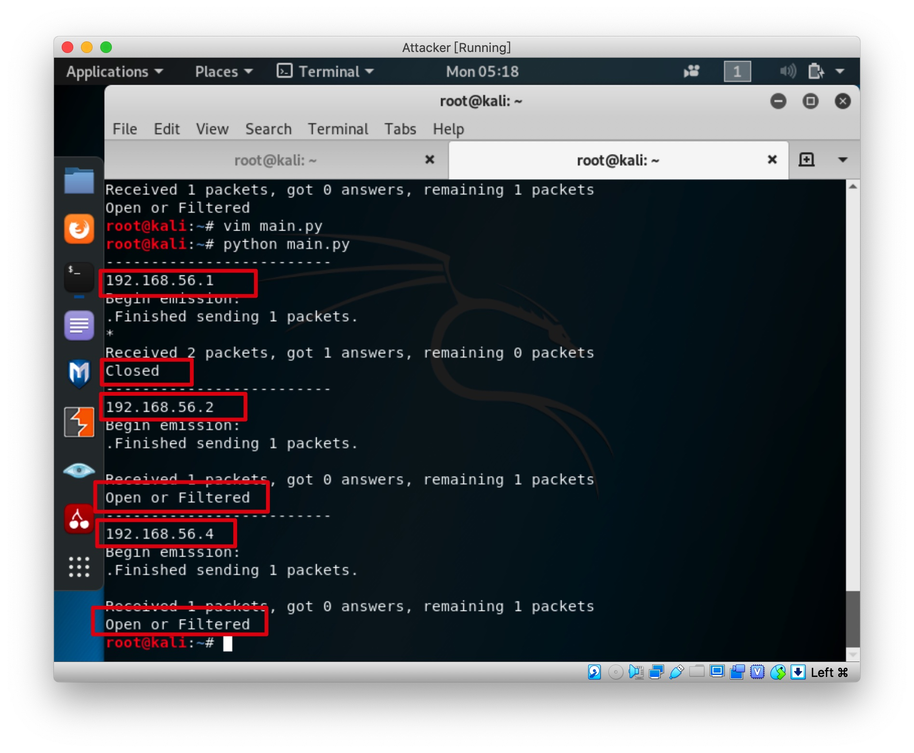
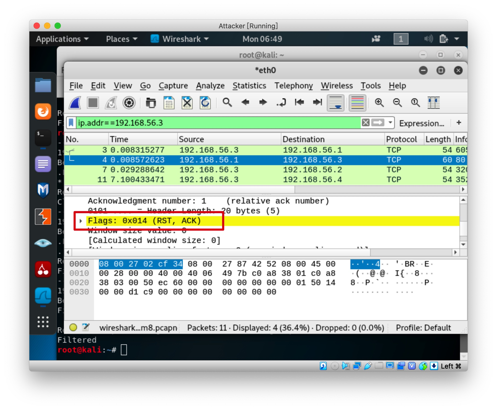
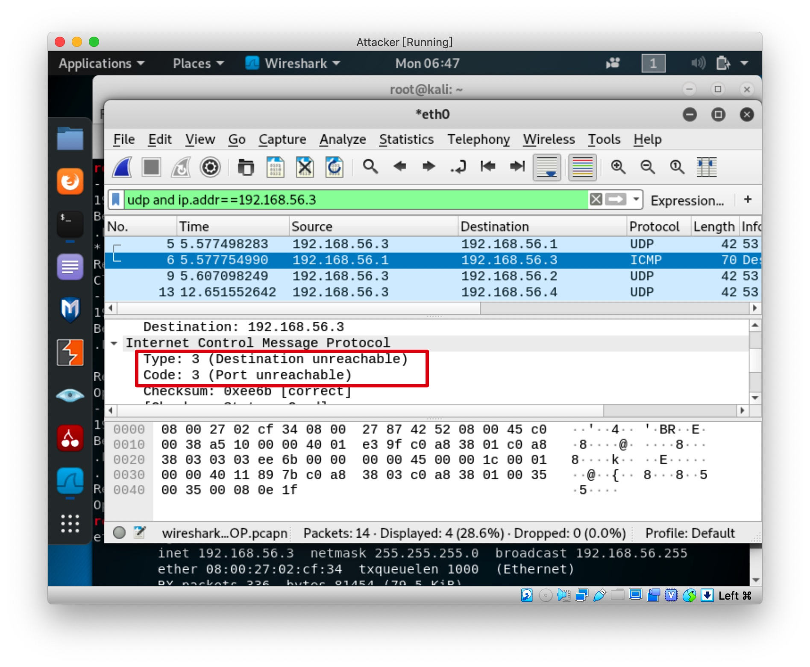

# 基于 Scapy 编写端口扫描器

## 实验目的

- 掌握网络扫描端口状态的基本原理

## 实验要求

- [x] TCP connect scan / TCP stealth scan
- [x] TCP Xmas scan / TCP fin scan / TCP null scan
- [x] UDP scan


## 实验环境

- 四台内网主机，其中一台是攻击者，负责所在网络状态的扫描。
- 另外三台分别用来对某一端口进行监听、关闭、过滤状态。

### 拓扑结构



## 端口模拟

- 关闭 ： 没有对某个端口开启监听且没有对此端口添加对应防火墙规则


- 开启 ：

使用netcat监听某端口，如80端口`nc -l -p 80`


使用`service dnsmasq start`开启53端口




- 过滤 ： 添加iptables规则，如80端口`iptables -A INPUT -p tcp --dport 80 -j DROP`


## TCP connect

```python
def tcp_connect_scan(dst_ip , dst_port , timeout = 5 , src_port = SRC_PORT):
    tcp_connect_scan_resp = sr1(IP(dst = dst_ip) / TCP(sport = src_port , dport = dst_port , flags = "S") , timeout = timeout)
    if tcp_connect_scan_resp is None:
       print "Filtered"
    elif (tcp_connect_scan_resp.haslayer(TCP)):
        if (tcp_connect_scan_resp.getlayer(TCP).flags == 'AS'):
            send_rst = sr1(IP(dst=dst_ip)/TCP(sport = src_port , dport=dst_port,flags="AR"),timeout=10)
            print "Open"
        elif (tcp_connect_scan_resp.getlayer(TCP).flags == 'AR'):
            print "Closed"
```

发送带有SYN标记的TCP包，如果没有收到任何返回包，则可能是发向对方端口的包被过滤了。如果收到的是带有ACK和SYN的标记的返回包，则说明端口是开启的，如果收到ACK和RST包，则说明端口关闭。

三种状态的运行结果如下




##  TCP stealth scan

```python
def tcp_stealth_scan(dst_ip , dst_port , timeout = 5 , src_port = SRC_PORT):
    stealth_scan_resp = sr1(IP(dst=dst_ip)/TCP(sport=src_port,dport=dst_port,flags="S"),timeout=timeout)
    if(stealth_scan_resp is None):
        print "Filtered"
    elif(stealth_scan_resp.haslayer(TCP)):
        if(stealth_scan_resp.getlayer(TCP).flags == 'AS'):
            send_rst = sr(IP(dst=dst_ip)/TCP(sport=src_port,dport=dst_port,flags="R"),timeout=timeout)
            print "Open"
        elif (stealth_scan_resp.getlayer(TCP).flags == 'AR'):
            print "Closed"
```

和TCP connect scan类似，不过这次攻击者在收到包含ACK&SYN的返回包之后，发送RST包，来防止一些防火墙的检测

三种状态的运行结果如下



## TCP Xmas scan 

```python
def tcp_xmas_scan(dst_ip , dst_port , timeout = 5,src_port = SRC_PORT):

    xmas_scan_resp = sr1(IP(dst=dst_ip)/TCP(dport=dst_port,flags="FPU"),timeout=10)
    if (xmas_scan_resp is None):
        print "Open or Filtered"
    elif(xmas_scan_resp.haslayer(TCP)):
        if(xmas_scan_resp.getlayer(TCP).flags == 'AR'):
            print "Closed"
```

这次发送的tcp包中，标记 PSH,、FIN和 URG。如果没有收到返回，则说明是该端口是打开的或者被过滤了。如果收到ACK&RST的包，则说明该端口关闭

三种状态的运行结果如下



## TCP fin scan

```python
def tcp_fin_scan(dst_ip , dst_port , timeout = 5 , src_port = SRC_PORT):
    fin_scan_resp = sr1(IP(dst=dst_ip)/TCP(dport=dst_port,flags="F"),timeout=timeout)
    if ( fin_scan_resp is None ):
        print "Open or Filtered"
    elif(fin_scan_resp.haslayer(TCP)):
        if(fin_scan_resp.getlayer(TCP).flags == 'AR'):
            print "Closed"
```
和xmas scan类似，这次发送的包，标记的是FIN，如果没有收到返回包，则说明端口打开或者被过滤了。如果返回的是ACK&RST，则说明端口关闭

三种状态的运行结果如下




## TCP null scan

```python
def null_scan(dst_ip , dst_port , timeout = 5 , src_port = SRC_PORT):
    null_scan_resp = sr1(IP(dst=dst_ip)/TCP(dport=dst_port,flags=""),timeout=timeout)
    if ( null_scan_resp is None ):
        print "Open or Filtered"
    elif(null_scan_resp.haslayer(TCP)):
        if(null_scan_resp.getlayer(TCP).flags == 'AR'):
            print "Closed"

```

TCP null scan中，攻击者发送的包不设置任何标志位，直接发送给主机的指定端口，如果未响应，则说明端口是打开的或者被过滤掉了，如果是ACK&RST，则说明端口关闭。

三种状态的运行结果如下



## UDP scan

```python
def udp_scan(dst_ip,dst_port,timeout = 5):
    udp_scan_resp = sr1(IP(dst=dst_ip)/UDP(dport=dst_port),timeout=timeout)
    if (udp_scan_resp is None):
        print "Open or Filtered"
    elif(udp_scan_resp.haslayer(ICMP)):
            if(int(udp_scan_resp.getlayer(ICMP).type)==3):
                return "Closed"
```

发送一个udp报文，如果没有响应，说明是端口开放的或者被过滤了，如果返回一个ICMP报文目标不可达，则说明端口关闭

三种状态的运行结果如下




以上实验的收发包情况均与预期一致，这里就不把所有抓包的截图放在这里了。




