# 常见蜜罐体验和探索

## 实验目的

- [x] 记录蜜罐的详细搭建过程；
- [x]  使用` nmap` 扫描搭建好的蜜罐并分析扫描结果，同时分析「 nmap 扫描期间」蜜罐上记录得到的信息
- [x]  如何辨别当前目标是一个「蜜罐」？以自己搭建的蜜罐为例进行说明；

## 实验环境

拓扑结构比较简单，一个攻击者和两个受害者，处在同一网段，系统均为kali，其中一个受害者使用低交互的 twisted-honeypots蜜罐，另一个受害者使用中等交互的Cowrie蜜罐

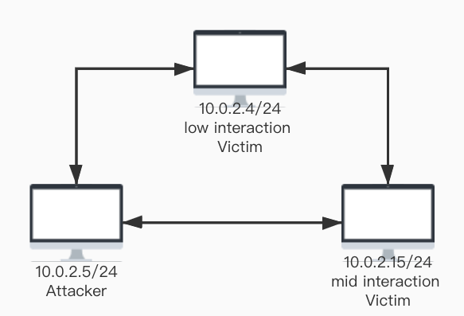

## 低交互蜜罐 : twisted-honeypots

### 环境搭建

该蜜罐安装非常友好，按照官网步骤基本可以，有几个需要注意的点。

- 官网上最后执行安装时`sudo ./install.sh && ./setup-db.sh`，经测试，需要先启动mysql服务，在执行安装和设置
- `twisted-honeypots`基于python3，所以使用前需要将默认python alias为python3
- 安装成功后使用以下命令即可进行启动、停止和监视

```bash
$ sudo ./start.sh
$ sudo ./stop.sh
$ ./monitor.sh
```

​	安装完成后，启动监视，界面大致如下

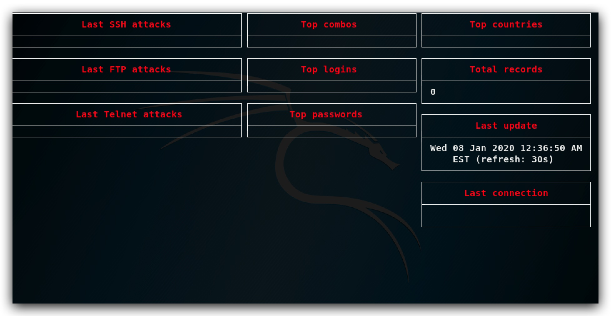

### 蜜罐体验

攻击者利用`metasploit`开始爆破telnet，先进行一些必要的设置如指定字典目录和受害者ip等

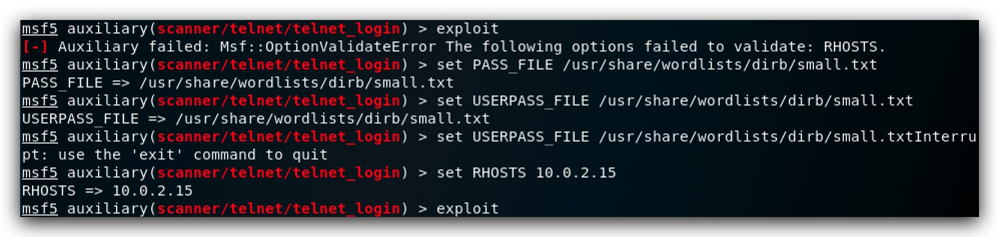

蜜罐这边使用`tail /var/log/twistd-pot.log -f`，实施监控蜜罐日志。过程如下。


此时查看工具提供的监视界面，显示信息如下

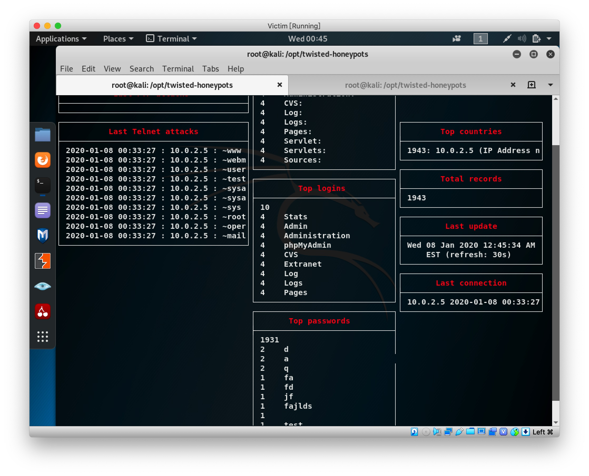

攻击者使用nmap扫描受害者，显示开放的服务如下，但貌似蜜罐这边的日志里并没有记录攻击者的此次扫描行为。


## 中等交互蜜罐 : Cowrie

### 环境搭建

Cowrie提供docker 的镜像，我们的kali首先需要安装docker，之前在做webgoat的时候，已经安装过了，这里就不过多叙述了

clone下来之后直接`make all`，记得启动docker服务`systemctl start docker`

```bash
git clone https://github.com/cowrie/docker-cowrie.git
make all
```

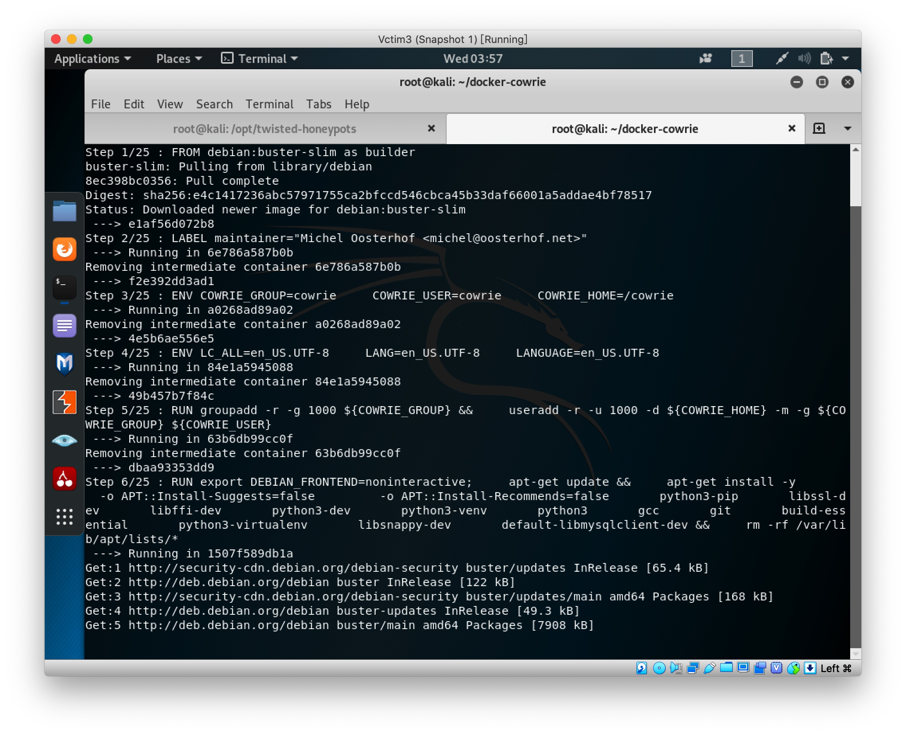

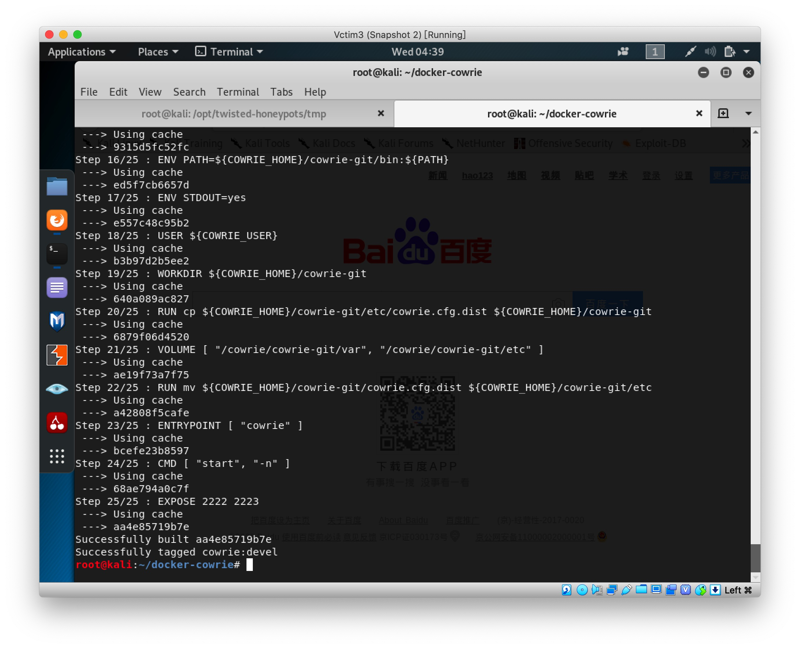

使用docker-compose启动构建容器并启动`docker-compose up -d`，同时进入容器的命令行界面`docker exec -it f26 /bin/bash`

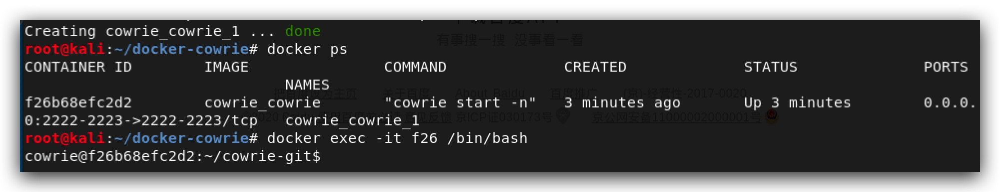

### 蜜罐体验


攻击者进行端口扫描，发现2222端口开启，蜜罐这边的貌似并没有任何关于nmap扫描的信息记录

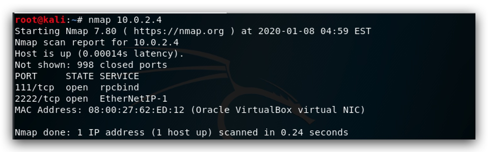

攻击者开始ssh连接2222端口该服务器的root用户，发现随便输入密码就进去了（感觉有点假，这里我们假设攻击者笨笨的没有意识到这是个蜜罐。）

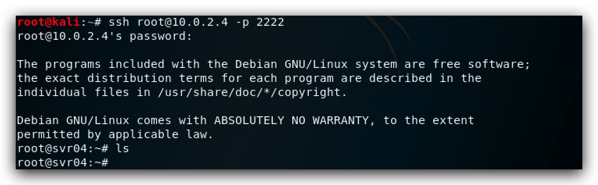

攻击者进入系统，开始执行操作，蜜罐这边同时也在监控日志，可以看到时间、ip、执行的指令等信息。


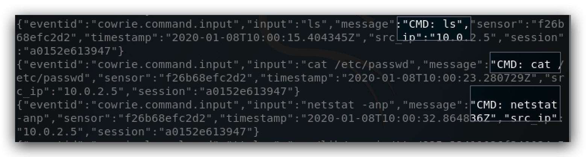


## 如何辨别当前目标是一个「蜜罐」

以Cowire为例，其实仔细观察的话，破绽还是非常多的。

首先，尝试ssh后，我们轻易登录root用户，如果我是攻击者，遇到这个情况我的第一反应不会是「这个用户好辣鸡哈哈哈」，而是「居然这么容易进来了，大概是个陷阱」。如果我设计蜜罐，大概会设置一个弱密码，可能需要一些字典的暴力才能进来。

其次，许多指令都存在一定的破绽。比如ping指令的时间始终是907ms。这种破绽需要我们多次尝试指令来辨别和发现。

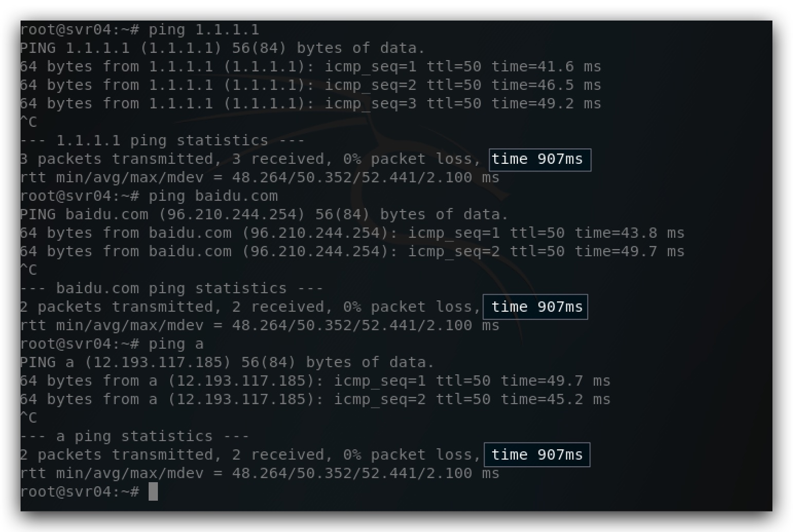

还有，进行一些探索，如果系统过于干净，没有什么软件，没有开启什么服务，且提供的信息过于简陋，也可能是蜜罐。


